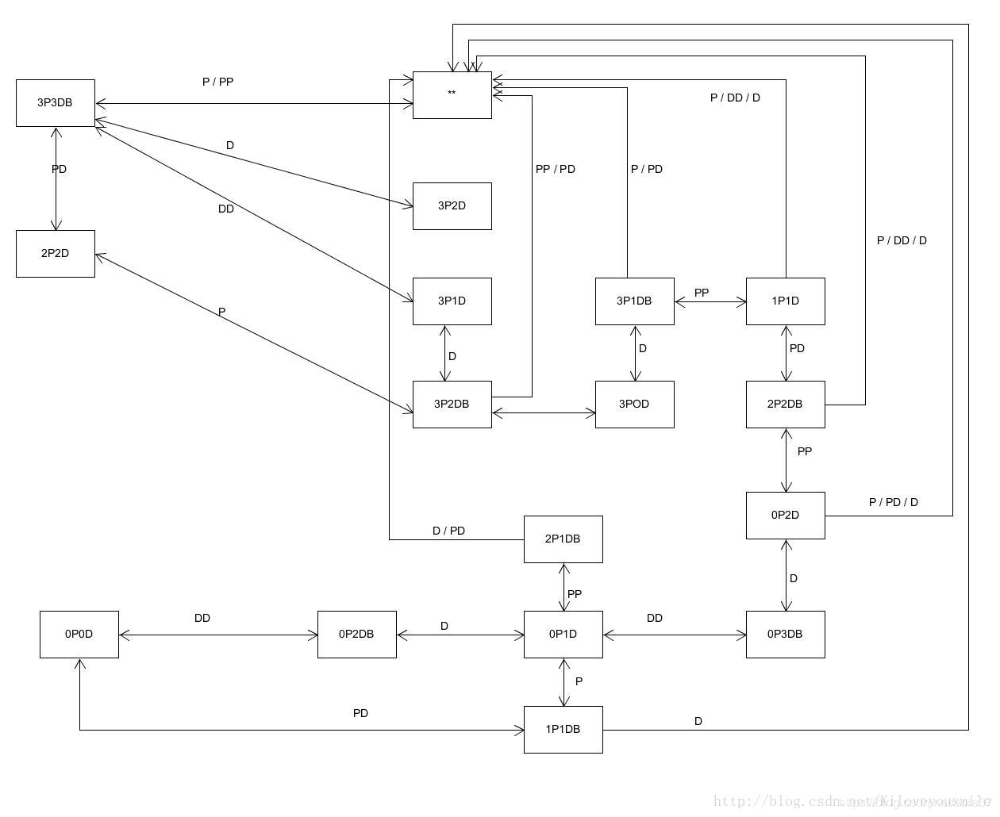

# Unity学习之P&D 过河游戏智能帮助实现

根据之前设计好的动作分离版过河游戏，我们进行一个简单的状态图AI实现。

## 转移状态图
状态图老师已经给出：


该状态图只记录了游戏过程中左岸的情况。P代表牧师，D代表魔鬼，B代表船。当船在右岸时不记录。双箭头代表两个状态可以相互转化。


## 构造状态图

```
next.boat = nowStatue;
    if (next.boat == Status.BLRING ||
        next.boat == Status.BRLING ||
        next.boat == Status.LOSE ||
        next.boat == Status.WIN || boatSize() != 0)
     {
          next.boat = Status.None;
          return next;
      }

      else
      {
           if (next.boat == Status.BLEFT &&
               leftPriests.Count == 3 && 
               leftDevils.Count == 3)
           {
                int turn = randomValue();
                if (turn == 1)
                    next.boataction = Boataction.PD;
                else
                    next.boataction = Boataction.DD;
            }

          else if (next.boat == Status.BRIGHT && 
               leftPriests.Count == 2 && 
               leftDevils.Count == 2)
           {
               next.boataction = Boataction.P;
           }

          else if (next.boat == Status.BRIGHT && 
               leftPriests.Count == 3 &&
               leftDevils.Count == 2)
           {
               next.boataction = Boataction.D;
            }

          else if (next.boat == Status.BRIGHT && 
               leftPriests.Count == 3 &&
               leftDevils.Count == 1)
           {
               next.boataction = Boataction.D;
           }

          else if (next.boat == Status.BLEFT && 
               leftPriests.Count == 3 &&
               leftDevils.Count == 2)
           {
               next.boataction = Boataction.DD;
            }

          else if (next.boat == Status.BRIGHT && 
               leftPriests.Count == 3 && 
               leftDevils.Count == 0)
            {
                next.boataction = Boataction.D;
            }

          else if (next.boat == Status.BLEFT &&
               leftPriests.Count == 3 &&
               leftDevils.Count == 1)
           {
               next.boataction = Boataction.PP;
           }

          else if (next.boat == Status.BRIGHT &&
              leftPriests.Count == 1 &&
              leftDevils.Count == 1)
          {
              next.boataction = Boataction.PD;
          }

         else if (next.boat == Status.BLEFT &&
             leftPriests.Count == 2 &&
             leftDevils.Count == 2)
         {
             next.boataction = Boataction.PP;
         }

         else if (next.boat == Status.BRIGHT &&
             leftPriests.Count == 0 &&
             leftDevils.Count == 2)
         {
             next.boataction = Boataction.D;
         }

        else if (next.boat == Status.BLEFT &&
            leftPriests.Count == 0 &&
            leftDevils.Count == 3)
        {
            next.boataction = Boataction.DD;
        }

       else if (next.boat == Status.BRIGHT &&
           leftPriests.Count == 0 &&
           leftDevils.Count == 1)
       {
           int turn = randomValue();
           if (turn == 1) next.boataction = Boataction.D;
           else next.boataction = Boataction.P;
        }

        else if (next.boat == Status.BLEFT &&
            leftPriests.Count == 2 &&
            leftDevils.Count == 1)
         {
              next.boataction = Boataction.P;
         }

         else if (next.boat == Status.BLEFT &&
             leftPriests.Count == 0 &&
             leftDevils.Count == 2)
         {
             next.boataction = Boataction.DD;
         }

         else if (next.boat == Status.BLEFT &&
             leftPriests.Count == 1 &&
                 leftDevils.Count == 1)
         {
             next.boataction = Boataction.PD;
         }

     }
```


## 搜索路径

```
while (queue.Count > 0)
        {
            temp = queue.Peek();

            if (temp == end)
            {
                while (temp.parent_state != start)
                {
                    temp = temp.parent_state;
                }
                return temp;
            }
            queue.Dequeue();

            if (temp.pos)
            {

                if (temp.lp > 0)
                {
                    GameState next = new GameState(temp);
                    next.parent_state = new GameState(temp);
                    next.pos = false;
                    next.lp--;
                    next.rp++;
                    if (next.isValid() && !queue.Contains(next))
                    {
                        queue.Enqueue(next);
                    }
                }
                if (temp.ld > 0)
                {
                    GameState next = new GameState(temp);
                    next.parent_state = new GameState(temp);
                    next.pos = false;
                    next.ld--;
                    next.rd++;
                    if (next.isValid() && !queue.Contains(next))
                    {
                        queue.Enqueue(next);
                    }
                }

                if (temp.ld > 0 && temp.lp > 0)
                {
                    GameState next = new GameState(temp);
                    next.parent_state = new GameState(temp);
                    next.pos = false;
                    next.ld--;
                    next.rd++;
                    next.lp--;
                    next.rp++;
                    if (next.isValid() && !queue.Contains(next))
                    {
                        queue.Enqueue(next);
                    }
                }

                if (temp.lp > 1)
                {
                    GameState next = new GameState(temp);
                    next.parent_state = new GameState(temp);
                    next.pos = false;
                    next.lp -= 2;
                    next.rp += 2;
                    if (next.isValid() && !queue.Contains(next))
                    {
                        queue.Enqueue(next);
                    }
                }

                if (temp.ld > 1)
                {
                    GameState next = new GameState(temp);
                    next.parent_state = new GameState(temp);
                    next.pos = false;
                    next.ld -= 2;
                    next.rd += 2;
                    if (next.isValid() && !queue.Contains(next))
                    {
                        queue.Enqueue(next);
                    }
                }
            }


            else

            {

                if (temp.rp > 0)
                {
                    GameState next = new GameState(temp);
                    next.parent_state = new GameState(temp);
                    next.pos = true;
                    next.rp--;
                    next.lp++;
                    if (next.isValid() && !queue.Contains(next))
                    {
                        queue.Enqueue(next);
                    }
                }

                if (temp.rd > 0)
                {
                    GameState next = new GameState(temp);
                    next.parent_state = new GameState(temp);
                    next.pos = true;
                    next.rd--;
                    next.ld++;
                    if (next.isValid() && !queue.Contains(next))
                    {
                        queue.Enqueue(next);
                    }
                }

                if (temp.rd > 0 && temp.rp > 0)
                {
                    GameState next = new GameState(temp);
                    next.parent_state = new GameState(temp);
                    next.pos = true;
                    next.rd--;
                    next.ld++;
                    next.rp--;
                    next.lp++;
                    if (next.isValid() && !queue.Contains(next))
                    {
                        queue.Enqueue(next);
                    }
                }

                if (temp.rd > 1)
                {
                    GameState next = new GameState(temp);
                    next.parent_state = new GameState(temp);
                    next.pos = true;
                    next.rd -= 2;
                    next.ld += 2;
                    if (next.isValid() && !queue.Contains(next))
                    {
                        queue.Enqueue(next);
                    }
                }

                if (temp.rp > 1)
                {
                    GameState next = new GameState(temp);
                    next.parent_state = new GameState(temp);
                    next.pos = true;
                    next.rp -= 2;
                    next.lp += 2;
                    if (next.isValid() && !queue.Contains(next))
                    {
                        queue.Enqueue(next);
                    }
                }
            }
        }
        return null;
    }

```


最后，更新GUI,以便正确提示输出即可

```
    void OnGUI()
    {
        GUIStyle fontstyle = new GUIStyle();
        fontstyle.normal.background = null;
        fontstyle.normal.textColor = new Color(255, 192, 203);
        fontstyle.fontSize = 50;

        style = new GUIStyle()
        {
            fontSize = 16
        };
        style.normal.textColor = new Color(0, 0, 0);
        buttonStyle = new GUIStyle("button")
        {
            fontSize = 16
        };

        if (GUI.Button(new Rect (Screen.width/2 - 50 , Screen.height- 50, 100, 40), "Reset", buttonStyle))
            {
                status = 0;
                userAction.Restart();
            }
        if (status == 1)
        {
            GUI.Label(new Rect (Screen.width/2- 50, 50, 100, 40), "Lose", style);
        }
        else if (status == 2)
        {
            GUI.Label(new Rect (Screen.width/2- 50, 50, 100, 40), "Win", style);
        }
        GUI.Button(new Rect(Screen.width/2 - 150 , 30, 400, 40), tips, style);

        if (GUI.Button(new Rect(Screen.width/2 - 300 , 30, 100, 40), "Tips", buttonStyle))
        {
            int[] arr = userAction.getStateInfo();
            leftPriests = arr[0];
            leftDevils = arr[1];
            rightPriests = arr[2];
            rightDevils = arr[3];

            if (arr[4] == 0) boat_pos = true;
            else boat_pos = false;
            start = new GameState(leftPriests, leftDevils, rightPriests, rightDevils, boat_pos, null);

            GameState temp = GameState.BFS(start, end);


            int p = leftPriests - temp.lp;
            int d = leftDevils - temp.ld;
            if (p < 0) p = -p;
            if (d < 0) d = -d;
            tips = "Move " + p + " priest(s)，" + d
                + " devil(s) to another side.";
        }
    }

```

## GUI更新

最后，我们更新GUI，从而能够正确提示即可

```
    void OnGUI()
    {
        GUIStyle fontstyle = new GUIStyle();
        fontstyle.normal.background = null;
        fontstyle.normal.textColor = new Color(255, 192, 203);
        fontstyle.fontSize = 50;

        style = new GUIStyle()
        {
            fontSize = 16
        };
        style.normal.textColor = new Color(0, 0, 0);
        buttonStyle = new GUIStyle("button")
        {
            fontSize = 16
        };

        if (GUI.Button(new Rect (Screen.width/2 - 50 , Screen.height- 50, 100, 40), "Reset", buttonStyle))
            {
                status = 0;
                userAction.Restart();
            }
        if (status == 1)
        {
            GUI.Label(new Rect (Screen.width/2- 50, 50, 100, 40), "Lose", style);
        }
        else if (status == 2)
        {
            GUI.Label(new Rect (Screen.width/2- 50, 50, 100, 40), "Win", style);
        }
        GUI.Button(new Rect(Screen.width/2 - 150 , 30, 400, 40), tips, style);

        if (GUI.Button(new Rect(Screen.width/2 - 300 , 30, 100, 40), "Tips", buttonStyle))
        {
            int[] arr = userAction.getStateInfo();
            leftPriests = arr[0];
            leftDevils = arr[1];
            rightPriests = arr[2];
            rightDevils = arr[3];

            if (arr[4] == 0) boat_pos = true;
            else boat_pos = false;
            start = new GameState(leftPriests, leftDevils, rightPriests, rightDevils, boat_pos, null);

            GameState temp = GameState.BFS(start, end);


            int p = leftPriests - temp.lp;
            int d = leftDevils - temp.ld;
            if (p < 0) p = -p;
            if (d < 0) d = -d;
            tips = "Move " + p + " priest(s)，" + d
                + " devil(s) to another side.";
        }
    }
```