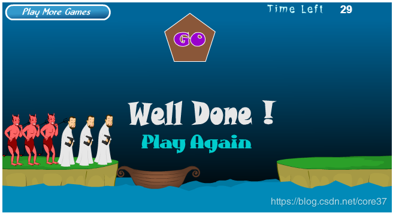
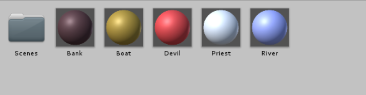
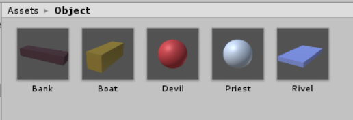
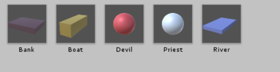

# 空间与运动

## 1.简答并用程序验证
### 游戏对象运动的本质是什么？
游戏对象运动的本质是游戏对象的空间属性（Position、Rotate、Scale）的数值随时间的变化

### 请用三种方法以上方法，实现物体的抛物线运动。（如，修改Transform属性，使用向量Vector3的方法…）
方法1

```

using System.Collections;
using System.Collections.Generic;
using UnityEngine;

public class Parabolic : MonoBehaviour {

	private float xv = 3;
    private float yv = 5;
    private float g = -1;
	// Use this for initialization
	void Start () {

	}

	// Update is called once per frame
	void Update () {
		yv += g * Time.deltaTime;
		this.transform.position += Vector3.right * xv * Time.deltaTime;
		this.transform.position += Vector3.down * yv * Time.deltaTime;
	}
}


```


方法2
```
using System.Collections;
using System.Collections.Generic;
using UnityEngine;

public class Parabolic : MonoBehaviour {

	private float xv = 3;
    private float yv = 5;
    private float g = -1;
	// Use this for initialization
	void Start () {

	}

	// Update is called once per frame
	void Update () {
		yv += g * Time.deltaTime;
		this.transform.Translate(xv * Time.deltaTime * Vector3.right + Vector3.down * yv * Time.deltaTime);
	}
}

```

方法3

```

using System.Collections;
using System.Collections.Generic;
using UnityEngine;

public class Parabolic : MonoBehaviour {

	private float xv = 3;
    private float yv = 5;
    private float g = -1;
	// Use this for initialization
	void Start () {

	}

	// Update is called once per frame
	void Update () {
		yv += g * Time.deltaTime;
		c = this.GetComponent<Rigidbody>();
    c.MovePosition(this.transform.position + Vector3.right * xv * Time.deltaTime
        + Vector3.down * yv * Time.deltaTime);

}

```


### 写一个程序，实现一个完整的太阳系， 其他星球围绕太阳的转速必须不一样，且不在一个法平面上。

使用cs为太阳添加脚本
```
using System.Collections;
using System.Collections.Generic;
using UnityEngine;

public class Solar : MonoBehaviour
{
    public Transform Mercury;  //水星
    public Transform Venus;  //金星
    public Transform Earth;  //地球
    public Transform Mars;  //火星
    public Transform Jupiter;  //木星
    public Transform Saturn;  //土星
    public Transform Uranus;  //天王星
    public Transform Neptune;  //海王星

    // Start is called before the first frame update
    void Start()
    {
        Sun.position = new Vector3(0, 0, 0);
        Mercury.position = new Vector3(2, 0, 0);
        Venus.position = new Vector3(33, 0, 0);
        Earth.position = new Vector3(4, 0, 0);
        Mars.position = new Vector3(5, 0, 0);
        Jupiter.position = new Vector3(6, 0, 0);
        Saturn.position = new Vector3(7, 0, 0);
        Uranus.position = new Vector3(8, 0, 0);
        Neptune.position = new Vector3(9, 0, 0);
    }

    // Update is called once per frame
    void Update()
    {
        Mercury.RotateAround(Sun.position, new Vector3(0, 3, 1), 23 * Time.deltaTime);
        Venus.RotateAround(Sun.position, new Vector3(0, 2, 1), 17 * Time.deltaTime);
        Earth.RotateAround(Sun.position, new Vector3(0, 1, 0), 10 * Time.deltaTime);
        Mars.RotateAround(Sun.position, new Vector3(0, 13, 5), 9 * Time.deltaTime);
        Jupiter.RotateAround(Sun.position, new Vector3(0, 8, 3), 8 * Time.deltaTime);
        Saturn.RotateAround(Sun.position, new Vector3(0, 2, 1), 7 * Time.deltaTime);
        Uranus.RotateAround(Sun.position, new Vector3(0, 9, 1), 4 * Time.deltaTime);
        Neptune.RotateAround(Sun.position, new Vector3(0, 7, 1), 3 * Time.deltaTime);

        Venus.Rotate(new Vector3(0, 3, 1) * 25 * Time.deltaTime);
        Mercury.Rotate(new Vector3(0, 2, 1) * 20 * Time.deltaTime);
        Earth.Rotate(new Vector3(0, 1, 0) * 30 * Time.deltaTime);
        Mars.Rotate(new Vector3(0, 3, 2) * 20 * Time.deltaTime);
        Jupiter.Rotate(new Vector3(0, 2, 1) * 30 * Time.deltaTime);
        Saturn.Rotate(new Vector3(0, 4, 1) * 20 * Time.deltaTime);
        Uranus.Rotate(new Vector3(0, 7, 1) * 20 * Time.deltaTime);
        Neptune.Rotate(new Vector3(0, 3, 1) * 30 * Time.deltaTime);
    }
```

## 编程实践

### 游戏中提及的事物

Priests（牧师）、Devil（恶魔）、Boat（小船）、River（河）、Bank（河岸）

### 玩家的动作 
| 主体                 | 动作 | 条件                                           | 效果     |
| -------------------- | ---- | ---------------------------------------------- | -------- |
| 船上的牧师或者恶魔   | 点击 | 船上有剩余角色                                 | 下船     |
| 河岸上的牧师或者魔鬼 | 点击 | 船上有空位且岸上有角色                         | 上船     |
| 船                   | 点击 | 船上至少有一个角色<br>岸上的牧师数量不少于魔鬼 | 移动船只 |

### 使用的材料预制
材料

预制


### MVC架构
MVC是界面人机交互程序设计的一种架构模式。它把程序分为三个部分：

模型（Model）：数据对象及关系
    游戏对象、空间关系
控制器（Controller）：接受用户事件，控制模型的变化
    一个场景一个主控制器
    至少实现与玩家交互的接口（IPlayerAction）
    实现或管理运动
界面（View）：显示模型，将人机交互事件交给控制器处理
    处收 Input 事件
    渲染 GUI ，接收事件

本例中通过使用在Script中分模块文件夹实现


### Controller
#### SSDirector
创建导演（使用单例模式实现）
```
public static SSDirector GetInstance()
    {
        if (_instance == null)
        {
            _instance = new SSDirector();
        }
        return _instance;
    }
```

 #### ISceneControllor
 场景控制器的接口，导演使用这个接口与场景控制器沟通，只需加载资源。

````
public interface ISceneController
{
    void LoadResources();           //加载场景
}
````

#### FirstController
控制器，对场景中的具体对象进行操作，挂载到一个空的游戏对象中

```

 public LandModel land1;
    public LandModel land2;
    public BoatModel boat;
    private RoleModel[] roles;
    UserGUI user_gui;
    void Start()
    {
        SSDirector director = SSDirector.GetInstance();
        director.CurrentScenceController = this;
        user_gui = gameObject.AddComponent<UserGUI>() as UserGUI;
        LoadResources();
    }

```


#### UserGUI
用于控制GUI的各种信息的展示，用户交互结构


```
    void Start(){
		action = Director.get_Instance ().curren as UserAction;

		Wordsetting = new GUIStyle ();
		Wordsetting.fontSize = 40;
		// MyStyle.normal.textColor = new Color (255f, 0, 0);
		Wordsetting.alignment = TextAnchor.MiddleCenter;
		Btnsetting = new GUIStyle ("button");
		Btnsetting.fontSize = 16;
	}
	void reset(){
		if (GUI.Button (new Rect (Screen.width/2 - 50 , Screen.height- 100, 100, 40), "Reset", Btnsetting)) {
			win = 0;
			action.restart ();
			moveable.move_able = 0;
		}
	}

	void OnGUI(){sets
		reset ();
		if (win == -1) {
			GUI.Label (new Rect (Screen.width/2- 50, 50, 100, 50), "Game Over", Wordsetting);
			reset ();
		} else if (win == 1) {
			GUI.Label (new Rect (Screen.width/2- 50, 50, 100, 50), "Win", Wordsetting);
			reset ();
		}
	}
```
#### Model
控制各个对象的参数和属性和行为

### 创建对应的预制




### 河岸对象行为的控制
通过对岸边对象的管理，生成对应的子对象。河岸需要对请求的上岸角色分配位置，并且在检查环节提供对应的牧师和魔鬼的数量，以便判断是否游戏结束。
```
public CharacterController(string Myname){
			if(Myname == "priest"){
				character = Object.Instantiate(Resources.Load("Prefabs/Priest", typeof(GameObject)), Vector3.zero, Quaternion.identity,null) as GameObject;
				Ctype = 0;
			}
			else{
				character = Object.Instantiate(Resources.Load("Prefabs/Devil", typeof(GameObject)), Vector3.zero, Quaternion.identity,null) as GameObject;
				Ctype = 1;
			}
			Cmove = character.AddComponent(typeof(moveable)) as moveable;
			clickgui = character.AddComponent(typeof(Event)) as Event;
			clickgui.setController(this);
		}


```


### 船舶对象行为的管理
船舶的主要行为是移动，以及判断每一次移动的合法性，对角色进行转移。
```
public BoatController(){
			TFflag = 1;
			from_pos = new Vector3[]{ new Vector3 (4.5f, 1.5f, 0), new Vector3 (5.5f, 1.5f, 0) };
			to_pos = new Vector3[]{ new Vector3 (-5.5f, 1.5f, 0), new Vector3 (-4.5f, 1.5f, 0) };
			boat = Object.Instantiate (Resources.Load ("Prefabs/Boat", typeof(GameObject)), fromPos, Quaternion.identity, null) as GameObject;
			boat.name = "boat";
			Cmove = boat.AddComponent (typeof(moveable)) as moveable;
			boat.AddComponent (typeof(Event));
		}
```


### 角色对象的管理

```
		public void getOnBoat(MyCharacterController tem_cha){
			int index = getEmptyIndex ();
			passenger [index] = tem_cha;
		}
		public MyCharacterController getOffBoat(string object_name){
			for (int i = 0; i < passenger.Length; i++) {
				if (passenger [i] != null && passenger [i].getName () == object_name) {
					MyCharacterController temp_character = passenger [i];
					passenger [i] = null;
					return temp_character;
				}
			}
			return null;
		}

```

对于每一个角色，它的任务是进行上下船操作，并移动到对应的位置，提供本身的状态位置标记给相应的类，进行游戏状态的更新和维护。