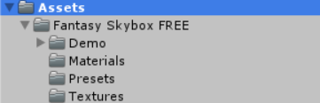

# 游戏对象与图形基础
## 下载天空盒并练习
1. 首先通过asset store下载skybox
2. import 进 project 目录

3. 创建一个新的material，在inspector中选择为shader-skybox-6sides
4. 选择下载到的贴图文件，拖放到对应的位置中 

5. 将对应的material添加到camera中


6. 观察到符合要求


## 写一个简单的总结，总结游戏对象的使用

unity中的游戏对象是unity游戏中的基本单位，可以是camera、light，也可以是gameobject、UI等。通过对对象的交互，可以实现一个游戏的功能。

游戏对象的使用一般是通过c#的script来完成，c#可以控制游戏对象中的行为，游戏对象的创建与销毁。

更多的，我们采用的是通过MVC模式来构建游戏，
Model（模型）是应用程序中用于处理应用程序数据逻辑的部分。通常模型对象负责在数据库中存取数据。
View（视图）是应用程序中处理数据显示的部分。通常视图是依据模型数据创建的。
Controller（控制器）是应用程序中处理用户交互的部分。通常控制器负责从视图读取数据，控制用户输入，并向模型发送数据。

同时我们可以更加细分的对控制器进行分配职能，例如设置动作管理器等方式来保持控制器的简洁性和可扩展性。


## 牧师与魔鬼动作分离版

添加一个裁判类，用来通知控制器当前游戏的状态是否结束。


添加类judgement

```
using System.Collections;
using System.Collections.Generic;
using UnityEngine;

namespace Com.Engine
{
    public class Judgement{
		public int Stat(CoastController fromCoast, CoastController toCoast, BoatController boat){
		if (moveable.move_able == 1)
			return 0;
		int from_priest = 0;
		int from_devil = 0;
		int to_priest = 0;
		int to_devil = 0;

		int[] from_count = fromCoast.getCharacterNum ();
		from_priest = from_count [0];
		from_devil = from_count [1];

		int[] to_count = toCoast.getCharacterNum ();
		to_priest = to_count [0];
		to_devil = to_count [1];

		if (to_devil + to_priest == 6)
			return 1;//you win
		int[] boat_count = boat.getCharacterNum();Stat
		if (boat.getTFflag () == 1) {
			from_priest += boat_count [0];
			from_devil += boat_count [1];
		} else {
			to_priest += boat_count [0];
			to_devil += boat_count [1];
		}
		if (from_priest < from_devil && from_priest > 0)
			return -1;//you lose
		if(to_priest < to_devil && to_priest > 0)
			return -1;//you lose
		return 0;//not yet finish
	}

    }
}
```


通过计算当前岸边的控制器状态，得到对应的当前状态下两边的牧师和魔鬼的数量，如果某一边牧师的数量比魔鬼少且不为0，则通知控制器当前游戏结束。


随后在控制器中实例化该裁判类即可。

```
public class MySceneController : MonoBehaviour, SceneController, UserAction{
	readonly Vector3 water_pos = new Vector3 (0, 0.5f, 0);
	UserGUI user;
	public CoastController fromCoast;
	public CoastController toCoast;
	public BoatController boat;
	public GameObject water;
	public Judgement judgement;
	//private MyCharacterController[] characters;
	private List<MyCharacterController> team;

	void Awake(){
		Director director = Director.get_Instance ();
		judgement = new Judgement();
		director.curren = this;
		user = gameObject.AddComponent<UserGUI> () as UserGUI;
		//characters = new MyCharacterController[6];
		team = new List<MyCharacterController>();
		loadResources ();
	}
```

